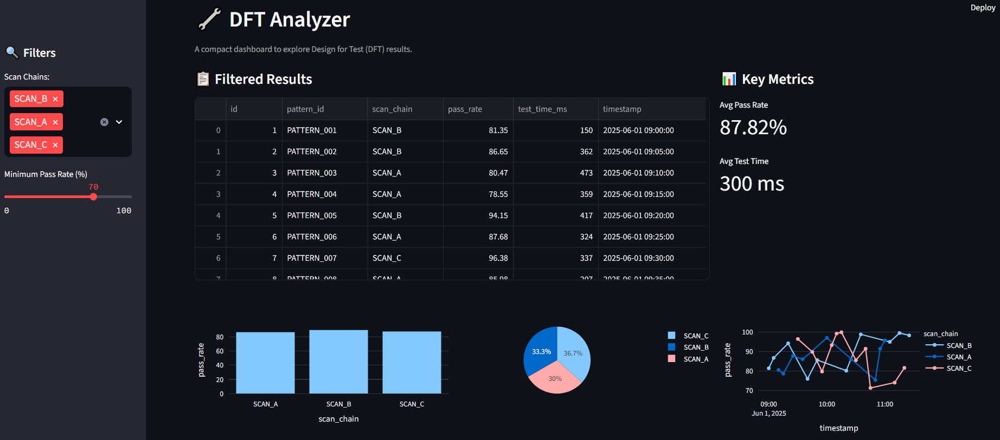

# 🔧 DFT Analyzer

A compact dashboard to analyze Design For Test (DFT) pattern data and scan chain performance using **Python**, **SQLite**, and **Streamlit**.

This project simulates process automation and data analysis tasks typically encountered in semiconductor QA and verification environments, aligning with industrial workflows and DFT-focused teams.

---

## 📌 Features

- 📋 View & filter simulated DFT test results
- 📊 Interactive KPIs (average pass rate, average test time)
- 📈 Visualizations:
  - Bar chart (Avg. pass rate per scan chain)
  - Pie chart (Scan chain distribution)
  - Line chart (Pass rate over time)
- 💾 SQLite backend with sample DFT records
- ⚙️ Fully modular, clean UI — fits in one dashboard frame

---

## 🛠️ Tech Stack

- **Frontend:** Streamlit
- **Backend:** SQLite
- **Data Analysis & Visualization:** Pandas, Plotly
- **Language:** Python 3.13

---

## 🚀 How to Run Locally

1. **Clone the repo**:
   ```bash
   git clone https://github.com/faisal5278/dft-analyzer.git
   cd dft-analyzer
   ```


2. **Install dependencies:**

```
pip install streamlit plotly pandas
```

3. **Create the database:**

```
python create_db.py
python insert_data.py
```

4. **Launch the app:**

```
streamlit run app.py

```
---

## 📸 Dashboard UI Screenshot



## 🎯 Why this project?

**It demonstrates:** 

- Tool development mindset

- Structured database handling

- Automated reporting and dashboarding

- Visualization of key DFT metrics in a single interface
"# DFT_analyzer" 
